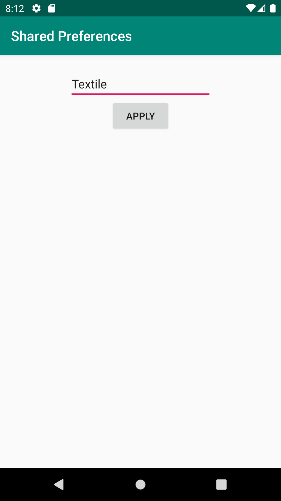
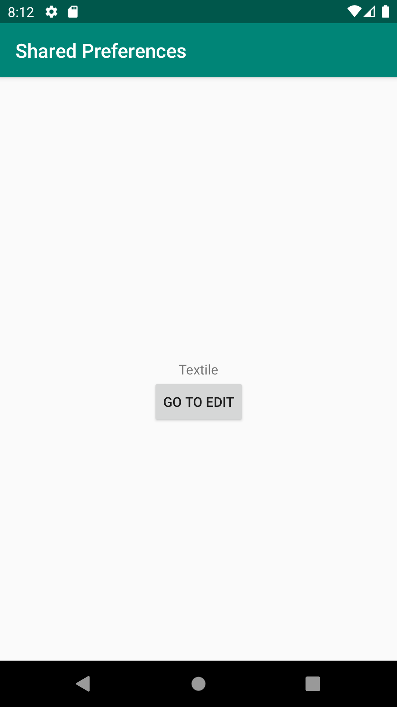

# Report

Firstly a second activity was created. The main activity was given a text-field and a button with the button slightly below the text centrally on
the screen. On the second activity a text-input-field was created and another button was made, arranged like the one on the main activity.

The button on the main activity was given an onClickListener that simply created an intent pointing to the second activity and starting said intent.
The button on the second was given an onClickListener as well that writes whatever is in the input-field to the shared preferences under the label
LabelText and then applies the preferences. The shared preferences were set to MODE_PRIVATE in both these cases.

In the main activity the onResume function is used to read the text under that same label and put it in the text-field. If there is nothing there
it writes a certain message instead (see code for this below).

End result of all this is that whatever the user writes and applies will be shown in the main activity until it is either changed or the data for
the app is deleted.

```
@Override
protected void onResume() {
    super.onResume();
    label.setText(myPreferenceRef.getString("LabelText", "Welcome to app"));
}
```


